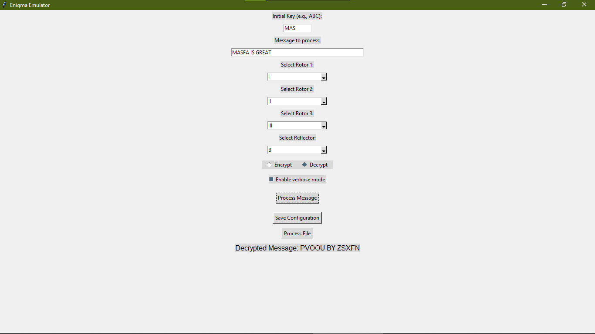
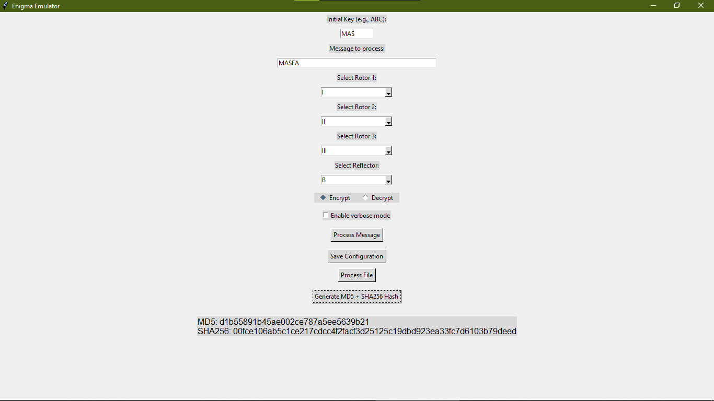

# 🔐 Enigma Encryption & Decryption Tool | Python GUI + CLI

A Python-based interactive simulation of the historic **Enigma Machine**, supporting **real-time encryption, decryption, hashing**, and **file processing** — built with both a **Graphical User Interface (GUI)** and **Command Line Interface (CLI)**.

> ⚙️ Ideal for showcasing **InfoSec knowledge, cryptographic fundamentals, and Python GUI development** in academic or professional settings.

---

## ✨ Key Features

- 🧠 **Enigma-based rotor encryption logic**
- 🔄 **Symmetric encryption & decryption logic**
- 🖼️ Full-featured **Tkinter GUI**
- 💻 Lightweight **CLI tool** included
- 💾 **Save & load custom configurations**
- 📂 **Encrypt/decrypt text files**
- 🔐 **MD5 + SHA256 hashing** support (via GUI)
- 🔍 **Verbose mode** for encryption steps
- ✅ **No external dependencies** required

---

## 📸 Screenshots

> _(Includes MD5 + SHA256 hash generator in GUI)_

  


---

## 🧠 Tech Stack

| Component       | Tool/Library |
| --------------- | ------------ |
| Language        | Python 3.x   |
| GUI Framework   | Tkinter      |
| Config Handling | JSON         |
| Hashing         | hashlib      |
| Testing         | unittest     |

---

## 🚀 How to Use

### 1️⃣ Clone the Repository

```bash
git clone https://github.com/masfaatanveer/enigma-infosec.git
cd enigma-infosec
```

---

### 2️⃣ Run CLI Interface

```bash
python cli_interface.py
```

- Load default/custom configuration
- Enter initial key (e.g., `MAS`)
- Choose to encrypt/decrypt a message or file
- Optionally save updated configuration

---

### 3️⃣ Run GUI Interface

```bash
python gui_interface.py
```

- Enter message and key
- Select rotors and reflector
- Choose **Encrypt** or **Decrypt**
- Use "Process Message" or "Process File"
- Generate **MD5 + SHA256 hash** with one click

---

## 🔁 Example (Encryption & Decryption)

With same configuration and key (`MAS`):

```text
Input Message: HELLO
Encrypted Message: XZLMP
Decrypted Message: HELLO
```

---

## 🔒 Hashing Example (via GUI)

For input `MASFA`:

```text
#### Hashed Output:
MD5: bcf213325c01e1c47bd0622ac6a1eaf3
SHA256: 9bc72c58d0c6482ae79861fd0e5359fa8d8b5ecad32ce3c167155de3f7122a4e
```

---

## 🧪 Unit Testing

```bash
python -m unittest discover -s tests
```

- Verifies rotor mapping symmetry
- Ensures encryption == decryption
- Checks reflector logic

---

## 📊 Performance (Benchmarked)

| Operation        | Time       |
| ---------------- | ---------- |
| Encrypt message  | Instant    |
| File processing  | < 1s (avg) |
| Save/load config | Instant    |
| Run full tests   | ~0.3 sec   |

---

## 📁 Project Structure

```bash
.
├── cli_interface.py         # CLI-based tool
├── gui_interface.py         # GUI with Tkinter
├── enigma.py                # Core Enigma logic
├── rotor.py / reflector.py  # Logic components
├── config/                  # Custom config files
├── tests/                   # Unit tests
└── README.md
```

---

## 📌 Notes

- ✅ Compatible with Windows / macOS / Linux
- ✅ No need to install any library — just pure Python
- 💡 Great for **InfoSec**, **Cryptography Demos**, or **University Projects**

---

## 👑 Author & License

> Developed, modified & maintained by [Masfa Tanveer](https://github.com/masfaatanveer) 🧠

This project is based on Enigma logic and educational adaptations.  
**Licensed under [MIT License](LICENSE)**

---

## 🏷️ Project Tag

[Python] [Cryptography] [Encryption] [Decryption] [Enigma-Machine] [GUI] [CLI] [Hashing] [InfoSec] [Cybersecurity] [Tkinter] [MD5] [SHA256]

```
enigma-infosec
```

> 🚀 A powerful Python-based rotor encryption system with file handling, hashing, and real-time GUI/CLI support — perfect for information security use cases.
